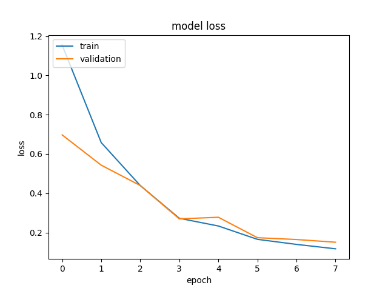
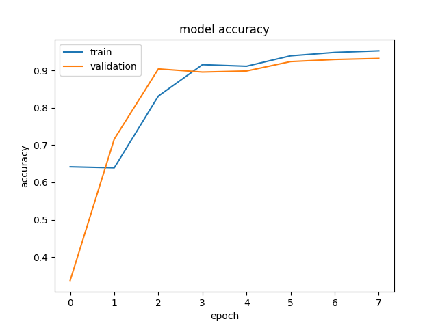
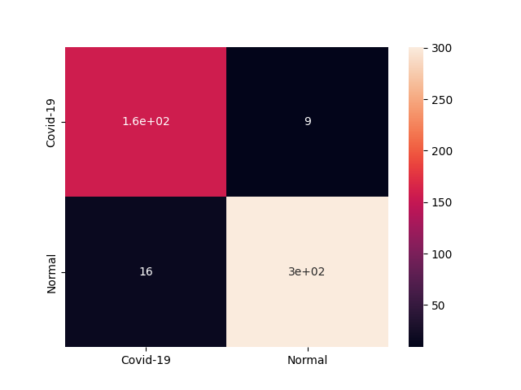

# Zeiny_train
- In this repo the training steps will be discussed

## Contents
- [Prerequisites](#prerequisites)
- [Training](#training)
- [Evaluation](#evaluation)

## Prerequisites
- Just install the libraries in the [requirements.txt](requirements.txt) file.

## Training
- Where 2 models were trained a [small model](models/model_small.h5) trained from scratch with the following architecture:
```
_________________________________________________________________
Layer (type)                 Output Shape              Param #
=================================================================
First_Conv2D (Conv2D)        (None, None, None, 32)    320
_________________________________________________________________
First_Maxpool (MaxPooling2D) (None, None, None, 32)    0
_________________________________________________________________
dropout (Dropout)            (None, None, None, 32)    0
_________________________________________________________________
Second_Conv2D (Conv2D)       (None, None, None, 64)    18496
_________________________________________________________________
Second_Maxpool (MaxPooling2D (None, None, None, 64)    0
_________________________________________________________________
global_average_pooling2d (Gl (None, 64)                0
_________________________________________________________________
Dense (Dense)                (None, 128)               8320
_________________________________________________________________
Output (Dense)               (None, 1)                 129
=================================================================
Total params: 27,265
Trainable params: 27,265
Non-trainable params: 0
_________________________________________________________________
```
- Where the other model was an [efficientnet based model](models/model_efficientnet.h5) with the following architecture:
```
_________________________________________________________________
Layer (type)                 Output Shape              Param #
=================================================================
input_2 (InputLayer)         [(None, None, None, 1)]   0
_________________________________________________________________
efficientnetb0 (Functional)  (None, None, None, 1280)  4049571
_________________________________________________________________
avg_pool (GlobalAveragePooli (None, 1280)              0
_________________________________________________________________
dense (Dense)                (None, 128)               163968
_________________________________________________________________
Output (Dense)               (None, 1)                 129
=================================================================
Total params: 4,213,668
Trainable params: 164,097
Non-trainable params: 4,049,571
_________________________________________________________________
```
- The difference in the number of parameters is huge so the performance of the [small model](models/model_small.h5) is by far much faster.
- To train your model just run the [train.py](train.py) while passing to its generator the training directory and the test directory to report the models results on it, to choose the [small model](models/model_small.h5) choose to train using the function `Model()`, while to train using the [efficientnet based model](models/model_efficientnet.h5) choose `efficientnet()`.

## Evaluation
- To evaluate any produced model on a test set use [eval.py](eval.py) while passing the desired `model.h5` file to it.
- To test any produced model on a single image use [test.py](test.py) while passing the desired `model.h5` file to it.
### [Efficientnet based model](models/model_efficientnet.h5):
- This model was trained only for 1 epoch so drawing a training/validation accuracy and loss graphs wasn't possible.
- Test set results:            
  - Precision: 99.07%               
  - Recall: 98.2%              
  - F1_score: 98.62%                
  - Accuracy: 98.76%                 
  - Confusion matrix:                  
  

### [small model](models/model_small.h5):
- **Training/validation loss graph**:                

- **Training/validation accuracy graph**:                

- Test set results:                   
  - Precision: 93.95%                
  - Recall: 94.78%                  
  - F1_score: 94.34%                 
  - Accuracy: 94.83%                 
  - Confusion matrix:               
  
- The [efficientnet based model](models/model_efficientnet.h5) got greater results but the [small model](models/model_small.h5) results can also be accepted due to its small number of parameters and faster performance.
